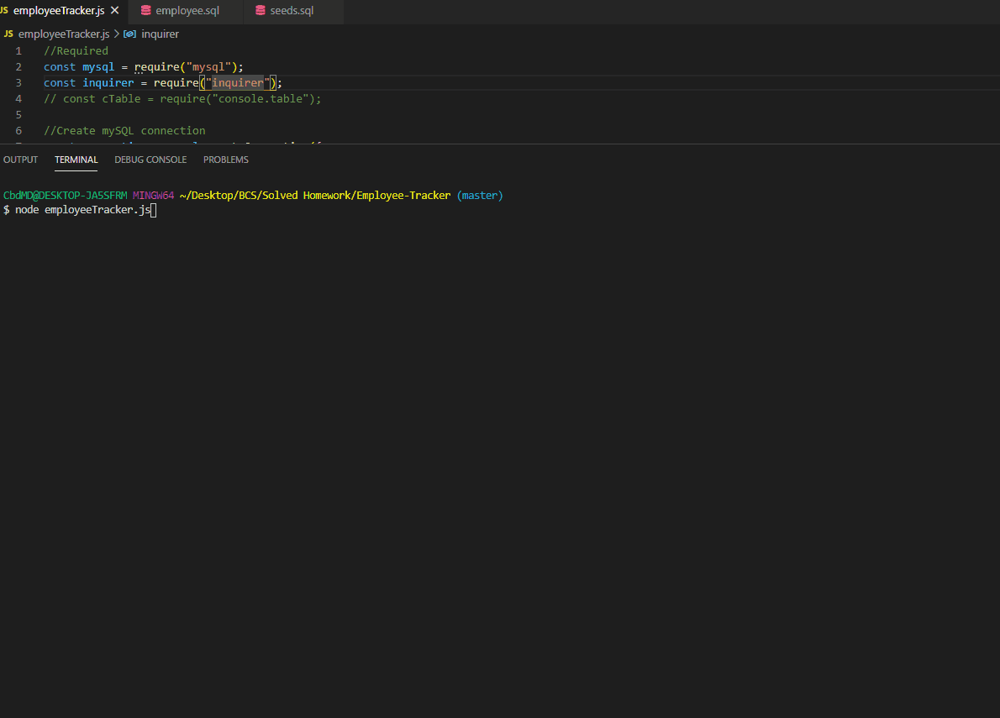

# Employee-Tracker

## Description 
This is a CLI app that allows you to manage employees, roles, and departments of your company.

## Demo



## User Story
```
As a business owner
I want to be able to view and manage the departments, roles, and employees in my company
So that I can organize and plan my business
```

## Technologies Used
* NodeJS
* mySQL
* Inquirer

## Installation

To install run npm i with requirered packages from the command line in the terminal.

```
npm i
```

## Author
Github: [sm-pixel](github.com/sm-pixel)
Email: [ms.samantha.marie.86@gmail.com](mailto:ms.samantha.marie.86@gmail.com)
  